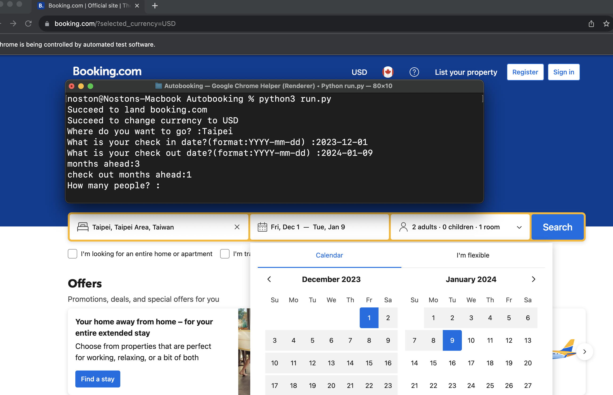

The code is run under MacOS, selenium4.11.2.

Users can type the location they want to go, nights they want to stay,
and the number of adults.

On the result page, the code will automatically pick 3-5 stars hotels,
and sort the price from lowerest.

The result will print on terminal by PrettyTable class.

Run the codes on terminal

The result on terminal:

