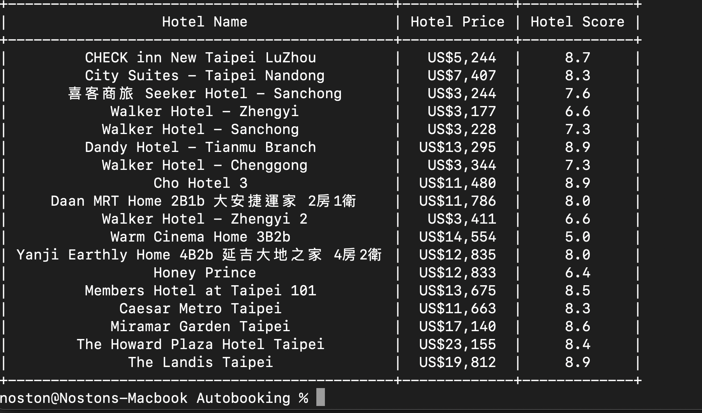

# Automate Booking.com Searching with Python 3 & Selenium




Users can use this Python script to automate hotel searches on Booking.com. It allows users to specify the location, number of nights, and the number of adults. The script will automatically filter and select 3-5 star hotels, sort the results by the lowest price, and display the results in a user-friendly table format using PrettyTable.

## Version: MacOS, selenium4.11.2

## Table of Contents

- [Features](#features)
- [Prerequisites](#prerequisites)
- [Usage](#usage)
- [Installation](#installation)
- [Contributing](#contributing)
- [License](#license)

## Features

- Automates hotel searches on Booking.com.
- User-friendly command-line interface (CLI) for input.
- Filters and selects 3-5 star hotels.
- Sorts search results by the lowest price.
- Presents results in a pretty table format using PrettyTable.

## Prerequisites

Before you begin, ensure you have met the following requirements:

- Python 3.x installed.
- Required Python packages installed. You can install them using `pip`:

  ```shell
  pip install -r requirements.txt
  ```
